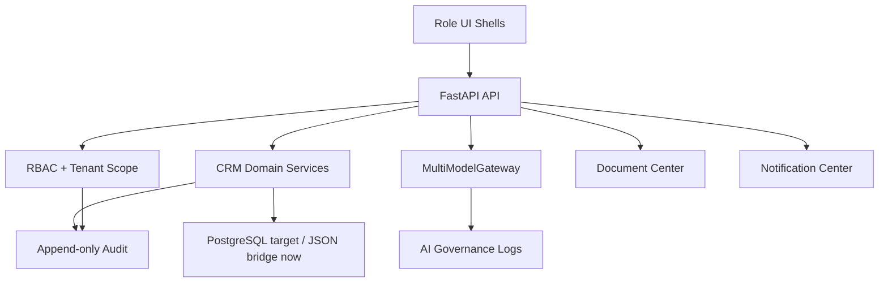

# ATLAS Rebuild Audit

Date: 2026-07-18

## 1. What Exists Now

ATLAS is a Python/FastAPI application deployed on Render with JSON-backed storage, a Telegram EWU bot webhook, public chat/onboarding screens, employer flow, coordinator dashboard, CRM repositories, AI gateway, RODO foundation, subscriptions/entitlements, competency intelligence, development recommendations, corporate AI and agent collaboration modules.

Current top-level domains:

- `api/`: FastAPI app plus HTML screens embedded as Python strings.
- `core/`: dataclass domain models.
- `database/`: JSON database and repositories.
- `crm/`: operational CRM service.
- `ai/`: asynchronous multimodel gateway foundation, providers, routing, privacy and safety modules.
- `services/`: application services for language, RODO, entitlements, agent profiles, competencies, corporate analysis and dialogue.
- `configs/`: countries, languages, professions and subscription plans.
- `tests/`: unit coverage for security, CRM workflows, AI gateway, RODO, entitlements, dialogue, backup, bot webhook and more.

## 2. What Works

- Render deployment works on the free plan.
- Dashboard login works through session cookies and password/hash/token environment support.
- EWU bot is available through webhook and can run independently of the local computer.
- Public chat persists memory and now syncs visible CRM candidates.
- Candidate photo upload exists in the coordinator dashboard and stores metadata safely.
- CRM can create candidates, employers, vacancies, matches and activity events.
- AI provider calls are behind `MultiModelGateway` with prompt separation, fallback, exact cache, privacy minimization, guard and usage tracking.
- RODO consent and data subject request foundations exist.
- Subscription catalog and entitlement service exist.
- Tests currently cover many critical backend paths.

## 3. What Does Not Work Well

- Frontend is not a structured frontend application. Large HTML/CSS/JS blocks are embedded in `api/*.py`.
- `api/dashboard.py` contains more than one dashboard HTML definition, making it easy to edit the wrong screen.
- Navigation is not role-configured from a central product model.
- CRM statuses are partly hardcoded in services and frontend actions.
- CRM entities do not yet cover the full target model: Person, Worker, Company, Application, Deal, Placement, Contract, Task, Note, Communication, Partner, Invoice, Incident and Risk.
- No full RBAC engine exists; admin routes are protected, but contextual permissions, tenant scopes and field-level authorization are not yet implemented.
- Multi-tenancy is not consistently modeled across all entities.
- Document Center is still basic and document upload/version/audit policies are incomplete.
- Notification Center, command palette, saved CRM views, Kanban view and Intelligence view are not yet production modules.
- Localization exists, but hardcoded interface strings remain in Python HTML screens.
- Analytics exists, but KPI definitions, trends and drill-downs are still early.
- Audit logging exists as CRM activity, but critical append-only audit has not been separated.
- Upload security validates image MIME and size for candidate photos, but broader file scanning and document policies are still needed.

## 4. What To Keep

- FastAPI deployment and current Render setup.
- JSON database for MVP continuity until migration to PostgreSQL.
- Existing CRM repositories and workflows as migration bridge.
- `MultiModelGateway` and provider boundary.
- RODO service and consent/request endpoints.
- Subscription/entitlement service.
- Language configuration and public language bootstrap.
- Existing public chat, employer flow, agent onboarding and coordinator dashboard until replacements are ready.
- Test suite and incremental deployment discipline.

## 5. What To Rewrite

- Frontend shell into domain-oriented modules or, in the current Python-stack phase, isolated HTML modules with shared design tokens and shared components.
- Dashboard into `ATLAS Control Center` with role-aware navigation, command center, CRM workspace and action queue.
- CRM models into a richer entity graph with Person/Company/Application/Deal/Task/Communication and tenant fields.
- Status handling into centralized pipeline configuration.
- Forms into schema-backed frontend and backend validation.
- Permissions into backend-enforced RBAC with contextual scopes.
- Document handling into a centralized Document Center.
- Analytics into role-based KPI definitions and API responses.

## 6. What To Remove Later

- Duplicate dashboard HTML definitions after the new Control Center fully replaces the old dashboard.
- Inline hardcoded navigation arrays and status labels.
- Placeholder emails/phones for production records once proper draft/contact-required state is implemented.
- Any remaining UI text that bypasses localization.
- Any test/demo data from production data storage after backup.

## 7. Risks

| Risk | Severity | Notes | Mitigation |
| --- | --- | --- | --- |
| Editing the wrong duplicate dashboard block | High | `api/dashboard.py` has duplicate `DASHBOARD_HTML` assignments | Split screens into separate modules and tests |
| Data model drift | High | Public memory, ProfessionalDNA and CRM candidates can diverge | Add sync services and eventual canonical Person model |
| No full tenant isolation | High | Future B2B data may mix without organization scopes | Add `organization_id` to all business entities before scale |
| RBAC incomplete | High | Hidden buttons are not sufficient | Backend permission service and scoped repositories |
| JSON storage limits | Medium | Good for MVP, not for large CRM | Backup and migrate to PostgreSQL |
| Hardcoded UI text | Medium | Localization inconsistency | Central translation keys and lint checks |
| Upload security | Medium | Basic MIME/size validation exists | Add document scanner and sensitive-file ACLs |
| Analytics trust | Medium | KPI definitions are not formal | Create KPI registry with formulas and sources |

## 8. Target Architecture

Target product contours:

- Personal ATLAS: worker/candidate AI agent, Professional DNA, opportunities, career, documents, learning and profile.
- Business ATLAS: employer advisor, workforce, recruitment, vacancies, analytics, learning, company and billing.
- ATLAS Control Center: CRM, candidates, companies, vacancies, deals, documents, learning, finance, AI control, risks, support, audit and settings.

## 9. Migration Plan Without Data Loss

1. Keep all existing endpoints and screens running.
2. Add centralized configs for product contours, role navigation and pipelines.
3. Add read-only Control Center workspace API that aggregates current CRM data.
4. Add new UI shell alongside old `/dashboard`, not replacing it immediately.
5. Introduce new CRM entities as additive dataclasses/repositories.
6. Backfill current candidates/employers/vacancies into Person/Company/Application records.
7. Add RBAC and tenant fields in compatibility mode with default tenant.
8. Add PostgreSQL migration scripts and dual-read validation.
9. Switch writes to new canonical models after backup and test migration.
10. Retire duplicate legacy UI only after parity checks pass.

## 10. Implementation Sequence

Phase 0:

- Create this audit.
- Add centralized product architecture and pipeline configs.
- Expose config through backend API.

Phase 1:

- Add ATLAS Control Center shell with role-aware navigation and AI Daily Brief.
- Keep legacy dashboard as fallback.
- Add CRM workspace summary API.

Phase 2:

- Add CRM workspace modes: Table, Kanban and Intelligence.
- Move statuses and transitions to pipeline config.

Phase 3:

- Add Candidate 360 and Company 360 screens.
- Add Document Center and Task/Notification models.

Phase 4:

- Add RBAC, tenant scopes, audit log and AI governance logs.

Phase 5:

- Migrate storage from JSON MVP to PostgreSQL or compatible managed database.
