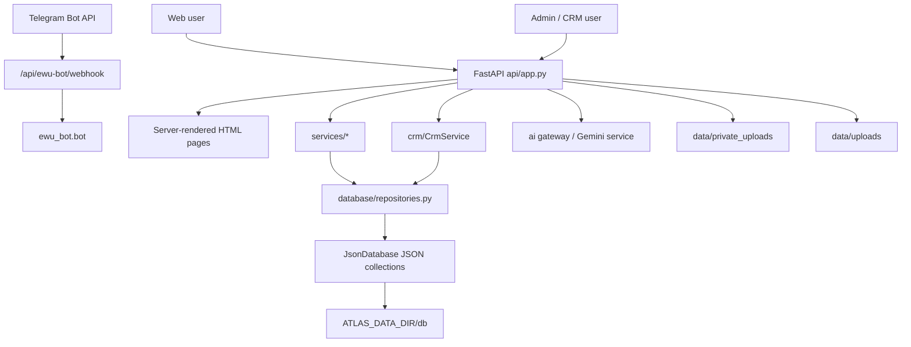

# ATLAS Technical Audit

Date: 2026-08-02
Scope: local repository `D:\ATLAS_EWU`, FastAPI app `api.app:app`, Render deployment config, EWU Telegram bot integration, existing tests, and documentation.

## Executive Summary

ATLAS is currently a Python 3.12 / FastAPI commercial MVP candidate with a server-rendered web UI, worker onboarding, employer onboarding, recruitment pipeline, explainable matching, RODO consent flows, private file uploads, EWU Telegram webhook, and Colosseum demo workflows.

The project is stable enough to run and test locally. The current suite passes:

```text
158 passed, 1 warning, 7 subtests passed
```

The main commercial-readiness blockers are not basic startup failures. They are authentication hardening, consistent RBAC, migration from JSON file storage to transactional storage, runtime artifact hygiene, production backup discipline, and full replacement of `X-ATLAS-User-Id` demo identity with a real session/account model.

## Current Architecture



## Factual Stack

- Runtime: Python 3.12.
- Backend: FastAPI, Uvicorn, Pydantic.
- Storage: JSON files through `database/json_database.py` and repository wrappers.
- File handling: private onboarding storage in `services/onboarding_file_storage.py`.
- AI: Gemini service plus a provider abstraction in `ai/`.
- Telegram: `pyTelegramBotAPI`, webhook bridge in `api/ewu_bot_webhook.py`.
- Deployment: Render free web service, persistent disk at `/var/data`.
- Frontend: server-rendered HTML/CSS/JS from Python modules plus static assets.
- Tests: pytest and FastAPI TestClient.

## What Works

- Landing and role pages.
- Worker onboarding with progress persistence.
- Universal private file upload for profile photo, CV, certificates and documents.
- CV parse job workflow and confirmation.
- Professional DNA generation.
- Employer onboarding and dashboard.
- Recruitment pipeline: vacancies, applications, interviews, evaluations, offers.
- Explainable matching engine with deterministic component scoring.
- Country management and public globe data.
- RODO consent, retention notice, data subject request primitives.
- Admin login with hashed default password support, session cookie and rate limit.
- EWU bot webhook secret validation and request body limit.
- Colosseum demo credential and escrow workflows.
- Full current test suite passes.

## What Works Partially

- Authorization: admin routes are protected, and company/application ownership checks exist in important flows, but many worker-facing APIs still use `X-ATLAS-User-Id` / cookie identity as an MVP shortcut.
- RBAC: role concepts exist in several places, but there is no single canonical permission service covering every endpoint.
- Database: repository boundary exists, but the actual persistence is JSON, not SQL/transactional storage.
- Solana: Colosseum demo produces safe Devnet-style proof links, but it is not a real Anchor program transaction signer.
- Notifications: EWU bot and internal notification concepts exist, but there is no central production notification service with retries and delivery ledger.
- Legal/GDPR docs: flows and notices exist, but legal texts are draft-level and need lawyer review.

## What Does Not Work Yet

- Real email verification and password recovery.
- Full account/password model for workers and employers.
- Full JWT or secure server-side user sessions for all public APIs.
- PostgreSQL/SQLAlchemy/Alembic migrations.
- Production-grade backup automation and restore drill.
- Centralized RBAC/ABAC across every API endpoint.
- Production Solana Anchor programs and wallet signing.
- Production payment/subscription/commission settlement.

## Route Surface Observations

The app exposes a large route surface from one FastAPI process. Important groups:

- Public pages: `/`, `/employee`, `/employer`, `/corporate`, `/gdpr`, `/jobs/{vacancy_id}`.
- Auth/admin: `/api/login`, `/api/logout`, `/dashboard`, `/control-center`.
- Onboarding: `/api/onboarding`, `/api/files/*`, `/api/cv/*`, `/api/professional-dna`.
- Employer/recruitment: `/api/employer/*`, `/api/vacancies/*`, `/api/applications/*`, `/api/offers/*`.
- Matching: `/api/matching/*`.
- Admin/CRM: `/api/candidates`, `/api/employers`, `/api/matches`, `/api/activity`, `/api/admin/*`.
- RODO/privacy: `/api/privacy/*`, `/privacy/export`, `/privacy/delete-request`, `/privacy/revoke-consent`.
- EWU bot: `/api/ewu-bot/health`, `/api/ewu-bot/webhook`.

## Critical Findings

### P0-1: Demo identity header still used in core flows

Evidence: multiple frontend pages and APIs use `X-ATLAS-User-Id`.

Impact: this is acceptable for local MVP and tests, but not safe as commercial identity because a caller can spoof another user id unless the endpoint has additional ownership checks.

Required fix: introduce real user sessions or JWT, then phase out direct trust in `X-ATLAS-User-Id` outside tests/demo mode.

### P0-2: JSON file storage is not a commercial database

Evidence: `JsonDatabase` stores whole collections as JSON files.

Impact: concurrency, durability, migration, reporting and access-control boundaries are limited.

Required fix: introduce SQLAlchemy + Alembic with SQLite for local development and PostgreSQL for production, behind existing repositories where possible.

### P0-3: Runtime artifacts are visible in the local working tree

Evidence: `git status` shows untracked `data/`, `dist/`, `.tmp-*`, and verification screenshot folders.

Impact: accidental commits or archive leakage could include personal files, generated packages, private uploads or stale verification artifacts.

Required fix: strengthen `.gitignore`, keep generated artifacts out of source control, and package releases from a clean staging directory.

### P0-4: Security headers were not centrally enforced

Evidence: no central FastAPI middleware was present for standard browser security headers.

Impact: weaker baseline protection against clickjacking, MIME sniffing, referrer leakage and broad browser permission use.

Fix applied: central middleware now adds `X-Content-Type-Options`, `X-Frame-Options`, `Referrer-Policy`, `Permissions-Policy`, HTTPS HSTS, and a conservative MVP-compatible CSP. Regression tests are in `tests/test_security_headers.py`.

## Security Risks

| ID | Risk | Severity | Status |
| --- | --- | --- | --- |
| S1 | Spoofable MVP user identity header | Critical | Open |
| S2 | JSON storage instead of transactional DB | High | Open |
| S3 | Runtime artifacts not fully ignored | High | Open |
| S4 | Missing centralized security headers | Medium | Fixed and tested |
| S5 | Broad route surface in one process | Medium | Accepted MVP tradeoff |
| S6 | Solana demo adapter is not real on-chain signing | Medium | Documented limitation |
| S7 | Legal/GDPR text not lawyer-reviewed | High | Open |

## Technical Debt

- `api/app.py` is too large and mixes API, HTML renderers and helpers.
- Some API paths are versioned only by convention and not under `/api/v1`.
- Existing repository boundary is useful, but model normalization is incomplete.
- Several newer docs exist with overlapping names and mixed status.
- Test suite is good, but Playwright happy path is not run as part of the Python test command.

## P0 Plan

1. Create this audit document.
2. Add security headers middleware and tests. DONE.
3. Strengthen `.gitignore` for runtime artifacts and generated archives. DONE.
4. Add/refresh deployment and backup docs.
5. Add an MVP status matrix.
6. Begin auth/RBAC hardening plan: central permission map and a migration path away from `X-ATLAS-User-Id`.
7. Begin database migration plan: SQLAlchemy models and Alembic baseline without deleting JSON production data.

## Verification Performed

Commands run:

```powershell
py -3.12 -m pytest -q
rg --files -g '!data/**' -g '!dist/**' -g '!.git/**'
rg -n --hidden -g '!data/**' -g '!dist/**' -g '!.git/**' "<secret-patterns>" .
```

Results:

- Tests: passed.
- Secret scan: no obvious committed API keys/tokens found in scanned source/config files.
- Local `.env` exists and contains runtime variables; values were masked during audit.

## Current MVP Priority Status

| Priority | Area | Status | Notes |
| --- | --- | --- | --- |
| P0 | Audit | DONE | This document is the current audit snapshot. |
| P0 | Startup/tests | DONE | Test suite passes locally. |
| P0 | Authorization | PARTIAL | Admin auth exists; user auth remains MVP-level. |
| P0 | RBAC | PARTIAL | Endpoint-specific checks exist; no single universal RBAC service. |
| P0 | Database | PARTIAL | JSON storage works, SQL migrations not implemented. |
| P0 | Secrets | PARTIAL | `.env` ignored and scan clean; CI secret scanning not present. |
| P0 | Secure documents | PARTIAL | Private storage exists; legacy public upload mount remains for public assets. |
| P1 | Worker profile | DONE | Onboarding and dashboard exist. |
| P1 | Employer profile | DONE | Employer onboarding and dashboard exist. |
| P1 | Vacancies/applications | DONE | Recruitment workflow tests pass. |
| P2 | AI matching | DONE | Deterministic explainable matching tests pass. |
| P3 | Payments/subscriptions | PARTIAL | Entitlements exist; production payments not implemented. |
