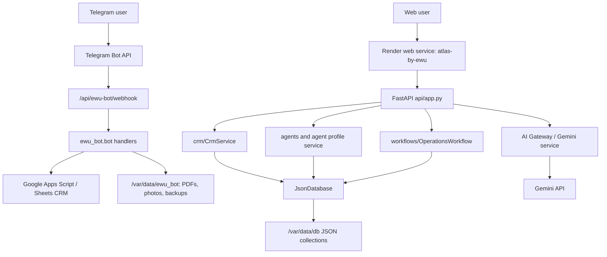

# ATLAS/EWU Audit Pack - 2026-07-18

Scope: local repository `D:\ATLAS_EWU`, deployed Render service `atlas-by-ewu`, and integrated EWU Telegram bot webhook.

## 1. Code Analysis

### Current runtime

- ATLAS runs as a FastAPI web service on Render.
- EWU bot is integrated into the same free Render web service through Telegram webhook.
- Main web entrypoint: `api.app:app`.
- Telegram webhook endpoint: `/api/ewu-bot/webhook`.
- Runtime storage:
  - ATLAS JSON DB: `ATLAS_DATA_DIR=/var/data/db`.
  - ATLAS memory: currently local default unless `JsonMemoryStore` also points to `/var/data`.
  - EWU bot data: `EWU_DATA_DIR=/var/data/ewu_bot`.
- External services:
  - Telegram Bot API.
  - Google Apps Script / Google Sheets CRM.
  - Gemini API.
  - Optional Sentry analytics/error reporting.

### Strengths

- Clear modular split: `api/`, `services/`, `crm/`, `database/`, `memory/`, `ai/`, `agents/`, `ewu_bot/`.
- Country and language logic is config-driven in `configs/`.
- AI provider boundary exists through `ai/ai_gateway.py` and `services/gemini_service.py`.
- Render persistent disk is configured for ATLAS and EWU bot runtime data.
- Telegram webhook uses `EWU_BOT_WEBHOOK_SECRET` header verification.
- Sentry sanitization removes request headers, cookies and request data before sending.
- Analytics module intentionally filters common PII keys.

### Weak points

- Admin login uses a hardcoded password value `atlas` in `api/app.py`.
- Several API endpoints expose candidate, employer, vacancy and match data without authentication.
- JSON storage has no encryption, locking, versioning or structured migrations.
- Static download folder exposes EWU bot source files publicly.
- EWU bot runtime state is in memory (`USERS = {}`), so active user conversations can be lost on restart.
- Telegram webhook processing is synchronous in the web request.
- No explicit RODO/GDPR consent, retention, deletion, export or DPA register exists in code.

## 2. Architecture Map

### Main modules

- `api/app.py`: public pages, chat, CRM API, admin API, language API, agent API.
- `api/ewu_bot_webhook.py`: webhook bridge from Telegram to EWU bot handlers.
- `ewu_bot/bot.py`: Telegram conversation flow, lead creation, admin commands.
- `ewu_bot/crm.py`: Google Script delivery and local backup.
- `database/json_database.py`: file-based storage adapter.
- `memory/memory_store.py`: user memory JSON storage.
- `services/gemini_service.py`: Gemini integration, retries, response parsing.
- `services/analytics.py`: privacy-filtered internal analytics events.

## 3. Security Audit

### Critical

1. Hardcoded admin password
   - Location: `api/app.py`, login checks `payload.password != "atlas"`.
   - Risk: anyone who knows or guesses the code can access the coordinator dashboard.
   - Fix: replace with `ATLAS_ADMIN_PASSWORD_HASH`, password hashing, session expiry and rate limits.

2. Public data APIs
   - Locations: `/api/candidates`, `/api/employers`, `/api/vacancies`, `/api/matches`, `/api/activity`.
   - Risk: candidate/employer data can be listed without login.
   - Fix: require admin auth for list/update endpoints; keep only explicitly public endpoints unauthenticated.

3. Public static source copy
   - Location: `api/static/downloads/EWU_bot/`.
   - Risk: source logic and deployment hints are public; future accidental secret/data files in this folder would be exposed.
   - Fix: remove public source folder from production or serve only a sanitized archive behind admin auth.

### High

4. JSON storage lacks concurrency protection
   - Location: `database/json_database.py`.
   - Risk: simultaneous requests can overwrite data or corrupt JSON.
   - Fix: PostgreSQL or SQLite with transactions as immediate next step.

5. Webhook does not limit body size
   - Location: `api/ewu_bot_webhook.py`.
   - Risk: oversized requests can increase memory/CPU usage.
   - Fix: reject large bodies before parsing.

6. Webhook processing is synchronous
   - Location: `api/ewu_bot_webhook.py`.
   - Risk: slow AI/PDF/Google Script operations may cause Telegram timeouts.
   - Fix: queue the update, return fast, process in background.

7. Session cookie is weak
   - Location: `api/app.py`.
   - Risk: cookie lacks `secure`, `max_age`, explicit path and real session token.
   - Fix: signed server-side sessions, `secure=True`, expiry, logout, CSRF protection.

### Medium

8. No structured audit log for admin actions.
9. Dependency versions are partly broad in `requirements.txt`.
10. AI prompts may include personal data sent to Gemini.
11. Telegram bot admin commands depend only on numeric `ADMIN_CHAT_ID`.
12. No brute-force protection on `/api/login`.
13. No automated secret scan in CI.

## 4. RODO / GDPR Audit

### Personal data processed

- Candidate profile: name, surname, birth date, nationality, city/country, profession, experience, certificates, documents, salary expectations, phone, WhatsApp.
- Employer profile: company name, contact person, phone/email, vacancy terms, housing/transport info.
- Telegram identifiers: user ID, username, chat IDs.
- Photos and PDFs generated by EWU bot.
- AI conversation memory and profile data.
- Operational activity logs and Google Sheets CRM records.

### Current compliance gaps

1. No explicit consent capture before collecting or sending data.
2. No privacy policy linked directly in Telegram flow and core web chat flow.
3. No data export endpoint for users.
4. No data deletion endpoint or deletion workflow.
5. No retention policy implemented in code.
6. No register of processors/subprocessors in repository.
7. No clear legal basis mapping per processing purpose.
8. No encryption-at-rest at application level for JSON files/PDF/photos.
9. No role-based access model beyond simple admin cookie and Telegram admin ID.
10. AI provider transfer is not explicitly disclosed in user flow.

### Minimum RODO controls to add

- Consent screen in Telegram and web before collecting personal data.
- Privacy policy page with controller identity, purposes, retention, rights, processors.
- Per-user delete/export flow.
- Admin-only data access with logs.
- Data retention jobs: delete stale leads and files after defined periods.
- DPA/subprocessor register: Render, Telegram, Google, Gemini, Sentry if enabled.
- AI minimization: send only necessary fields to Gemini; redact phone/email/documents unless needed.

## 5. Risk Register

| ID | Risk | Severity | Likelihood | Impact | Mitigation |
| --- | --- | --- | --- | --- | --- |
| R1 | Public API exposes personal data | Critical | High | RODO breach, reputation damage | Lock data endpoints behind admin auth |
| R2 | Hardcoded admin code | Critical | High | Unauthorized dashboard access | Env-based hashed password and sessions |
| R3 | Static EWU source folder public | High | Medium | Accidental data/secret exposure | Remove or protect public source downloads |
| R4 | JSON write race/corruption | High | Medium | Lost leads and broken CRM state | Move to PostgreSQL |
| R5 | Free Render sleep delays Telegram replies | Medium | High | Bad UX, missed first response | Upgrade later or use external uptime monitor |
| R6 | Telegram webhook sync timeout | High | Medium | Dropped/late messages | Background queue |
| R7 | No consent/deletion/export flows | Critical | High | RODO non-compliance | Implement RODO workflows |
| R8 | PII sent to Gemini without explicit consent | High | Medium | Processor/legal risk | Consent + minimization/redaction |
| R9 | Local/Render data backup not automated | High | Medium | Data loss | Scheduled backups to encrypted storage |
| R10 | Single service hosts web and bot | Medium | Medium | Bot load can affect web | Queue separation or paid worker later |
| R11 | No WAF/body limits | Medium | Medium | Abuse/DoS | Request size limits and rate limits |
| R12 | No CI security checks | Medium | Medium | Regression risk | Add tests, secret scan, dependency audit |

## 6. Backup

Created local backup archive:

- `D:\ATLAS_EWU_BACKUP_AUDIT_20260718-173903.zip`
- Size: approximately 17 MB.
- Verification: archive inspected; excluded files count was `0`.

Backup policy used:

- Includes project source, docs, configs, assets and current local JSON data.
- Excludes `.git`, `.env`, `.env.local`, `__pycache__`, `.pytest_cache`, logs, temporary files and browser/download artifacts.
- Render environment secrets are not exported into the archive. Store Render secrets separately in a password manager.

Recommended production backup policy:

- Daily encrypted backup of `/var/data/db`, `/var/data/memory`, `/var/data/ewu_bot`.
- Weekly full source snapshot from GitHub release tag.
- Monthly restore drill to a staging Render service.
- Store backups in EU-region storage if possible.

## 7. Migration Plan

### Phase 0 - Stabilize current free setup

- Keep ATLAS and EWU bot in one Render free web service.
- Remove public source folder or restrict it.
- Add admin auth to all data endpoints.
- Add body size limit to Telegram webhook.
- Add `/api/rodo/export/{user_id}` and `/api/rodo/delete/{user_id}` draft endpoints behind verification.

### Phase 1 - Data layer migration

- Introduce PostgreSQL models for:
  - candidates;
  - employers;
  - vacancies;
  - matches;
  - documents;
  - activity;
  - agent memory;
  - Telegram leads and files metadata.
- Implement `PostgresDatabase` behind the existing repository interfaces.
- Write JSON-to-Postgres migration script.
- Run migration in staging, compare counts and sample records.
- Switch production with read-only JSON fallback.

### Phase 2 - Security foundation

- Replace access code with admin users table and password hashes.
- Add server-side sessions, CSRF protection and logout.
- Add role-based permissions: owner, admin, coordinator, read-only.
- Add request logging without PII.
- Add dependency/secret scanning in CI.

### Phase 3 - RODO foundation

- Add consent records table.
- Add privacy policy and processor register.
- Add export/delete flows.
- Add retention scheduler.
- Add AI disclosure and minimization controls.

### Phase 4 - Bot reliability

- Move webhook processing to a queue.
- Store conversation state persistently instead of `USERS = {}` memory.
- Add idempotency by Telegram update ID.
- Add monitoring for webhook errors and Google Script failures.

### Phase 5 - Scale beyond free hosting

- Split into:
  - `atlas-api` web service;
  - `ewu-bot-worker` background worker;
  - PostgreSQL;
  - object storage for PDFs/photos.
- Add staging/production environments.
- Add automated database backups and restore tests.

## 8. Immediate Priority List

1. Protect `/api/candidates`, `/api/employers`, `/api/vacancies`, `/api/matches`, `/api/activity`.
2. Replace hardcoded `atlas` login.
3. Remove public `api/static/downloads/EWU_bot/` source folder from production.
4. Add RODO consent text to Telegram `/start` and web AI chat.
5. Move JSON storage to PostgreSQL or at least add file locking.
6. Persist EWU bot user state outside memory.
7. Add webhook body limit and fast response queue.

## 9. Verification Notes

- Python syntax check passed with `py -3.12 -m compileall -q api ewu_bot`.
- Full test suite was not run because local Python does not currently have `pytest` installed.
- Git working tree before this audit document was clean.
