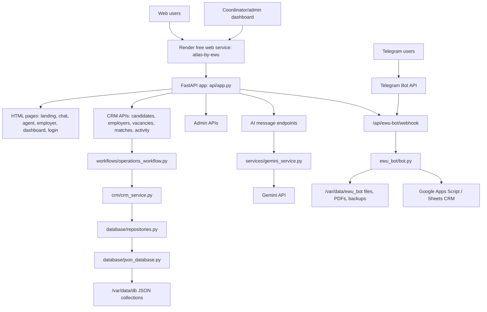

# ATLAS Current-State Audit

Date: 2026-07-18

Scope: Stage 0 only. This document audits the current ATLAS repository, the Render deployment `atlas-by-ewu`, and the EWU Telegram bot integration. It intentionally does not implement the later architecture stages from the expansion brief.

## 1. Executive Summary

ATLAS is currently a FastAPI MVP deployed on Render as a single free web service. It serves public web pages, AI chat, CRM-style endpoints, an admin dashboard, and the EWU Telegram bot webhook from the same process.

The current foundation is good enough for a prototype and early operational use, but not yet ready for the requested universal AI operating system, multi-agent platform, corporate accounts, subscriptions, or full RODO/GDPR-grade operations. The main blockers are authentication, authorization, data isolation, RODO workflows, storage durability, and production backup/migration discipline.

Critical findings:

- `api/app.py` uses a hardcoded admin access code: `atlas`.
- Candidate, employer, vacancy, match, and activity endpoints are publicly readable or writable in several places.
- ATLAS uses JSON files for core storage, without transaction guarantees or concurrent write protection.
- RODO/GDPR consent, export, deletion, retention, and processor registry are not implemented as user-facing workflows.
- The EWU bot is now server-hosted through the ATLAS Render service, but it shares the same free runtime and can be affected by Render sleep/cold starts.
- A public static copy of EWU bot source files exists under `api/static/downloads/EWU_bot/`.

Stage gate: do not start Stage 1 implementation until the owner explicitly accepts this audit and chooses which risks must be fixed first.

## 2. Current Architecture

Runtime deployment:

- Production URL: `https://atlas-by-ewu.onrender.com`.
- Render service type: `web`.
- Render plan: `free`.
- Start command: `uvicorn api.app:app --host 0.0.0.0 --port $PORT`.
- Persistent disk: `/var/data`, size `1 GB`.
- ATLAS data directory: `ATLAS_DATA_DIR=/var/data`.
- EWU bot data directory: `EWU_DATA_DIR=/var/data/ewu_bot`.

## 3. Code Analysis

Main modules to keep:

- `api/app.py`: main FastAPI composition and public API surface.
- `api/ewu_bot_webhook.py`: Telegram webhook bridge for EWU bot.
- `crm/crm_service.py`: operational CRM workflow logic.
- `database/repositories.py`: useful repository boundary that can later point to PostgreSQL.
- `database/json_database.py`: acceptable temporary adapter for MVP and migration source.
- `core/models.py`: domain dataclasses for users, candidates, employers, vacancies, documents, matches, activity, and early agent objects.
- `services/gemini_service.py`: Gemini provider wrapper with retries, timeout, JSON repair, and fallback handling.
- `ai/`: more formal AI gateway/provider boundary.
- `agents/`: early agent role modules.
- `configs/`: country, language, profession, and subscription configuration.
- `ewu_bot/`: Telegram bot logic now imported by ATLAS webhook runtime.

Current strengths:

- The project already has domain modules instead of one monolithic script.
- Country/language/profession data is partly config-driven.
- There is an existing AI gateway direction in `ai/`.
- Render persistent disk is configured.
- EWU bot webhook validates Telegram secret token when `EWU_BOT_WEBHOOK_SECRET` is set.
- Existing observability code includes PII filtering concepts.

Current architectural limits:

- Web app, admin dashboard, CRM API, AI endpoints, and Telegram bot all share one process.
- Storage is file-based JSON, so concurrent requests can overwrite data.
- Role model exists in `core/models.py`, but enforcement is partial.
- Agent memory and Professional DNA models exist, but they are not yet the canonical data backbone for all flows.
- There is no tenant model, no organization model, and no account boundary.
- There is no migration framework.
- There is no production backup job.

## 4. API And Access Surface

Public pages:

- `/`
- `/{language_code}`
- `/chat`
- `/{language_code}/chat`
- `/agent`
- `/{language_code}/agent`
- `/employer`
- `/{language_code}/employer`
- `/login`
- `/dashboard`

Health and AI:

- `/api/health`
- `/api/ai/health`
- `/api/ai/message`
- `/api/ewu-bot/health`
- `/api/ewu-bot/webhook`

CRM data endpoints currently exposed:

- `GET /api/candidates`
- `POST /api/candidates`
- `PATCH /api/candidates/{candidate_id}/status`
- `PATCH /api/candidates/{candidate_id}/documents-received`
- `GET /api/employers`
- `POST /api/employers`
- `PATCH /api/employers/{employer_id}/verify`
- `GET /api/vacancies`
- `POST /api/vacancies`
- `PATCH /api/vacancies/{vacancy_id}/status`
- `POST /api/vacancies/{vacancy_id}/match`
- `GET /api/matches`
- `PATCH /api/matches/{match_id}/status`
- `GET /api/activity`

Issue: several of these endpoints should be admin/coordinator-only but currently do not call `_require_admin`.

## 5. Authentication And Roles

Current state:

- Login checks a plain submitted password against a hardcoded value.
- A cookie named `atlas_role` is set to `admin`.
- `_require_admin` accepts `atlas_role` values `owner` or `admin`, or a matching `x-atlas-admin-token`.
- The role enum exists in `core/models.py`, but it is not consistently enforced across API endpoints.

Security gap:

- The app has roles in domain vocabulary, but not a real identity/session system.

Required direction:

- Replace hardcoded password with `ATLAS_ADMIN_PASSWORD_HASH`.
- Use signed sessions or a server-side session store.
- Add logout and session expiry.
- Enforce route-level authorization by role.
- Introduce owner/admin/coordinator/employer/candidate scopes.
- Add brute-force protection and audit logs for admin login attempts.

## 6. Data Architecture

Current storage:

- `database/json_database.py` stores collections as JSON files.
- Default path is `data/db`, or `/var/data/db` when `ATLAS_DATA_DIR=/var/data`.
- EWU bot stores operational files under `/var/data/ewu_bot`.
- EWU bot can forward leads to Google Apps Script / Google Sheets.

Risks:

- JSON files are not safe under concurrent writes.
- No schema versioning.
- No migrations.
- No row-level access or tenant boundaries.
- No application-level encryption for personal data.
- No automatic backup/restore process.

Recommended target:

- PostgreSQL for candidates, employers, vacancies, matches, documents, activity, accounts, organizations, tenants, consents, and agent memory.
- Object storage or controlled disk storage for files and PDFs.
- Migration scripts from current JSON collections into PostgreSQL.
- Explicit schema versioning with Alembic or equivalent.

## 7. AI And Agent Architecture

Current state:

- `services/gemini_service.py` calls Gemini and normalizes JSON responses.
- `ai/ai_gateway.py` and providers exist as an early abstraction.
- Domain-specific agents exist in `agents/`, including candidate, employer, coordinator, document, legal, and matching agents.
- `ProfessionalDNA`, `AgentMemoryRecord`, `AgentAction`, and `AgentRecommendation` exist in `core/models.py`.

Gaps against the expansion brief:

- No universal agent runtime.
- No per-user long-term memory consent boundary.
- No skill graph.
- No competency ontology.
- No dynamic AI interview engine as a standalone module.
- No skill-gap engine.
- No development-plan engine.
- No corporate AI agent workspace.
- No tenant-specific agent isolation.

Recommended target:

- Create a stable `core/identity`, `core/consent`, `core/tenancy`, `core/agent_runtime`, and `core/professional_dna` foundation before feature expansion.
- Keep AI provider calls behind a single gateway and add PII minimization before model calls.

## 8. Security Audit

Critical:

| ID | Finding | Evidence | Impact | Required fix |
| --- | --- | --- | --- | --- |
| S1 | Hardcoded admin password | `api/app.py` checks `payload.password != "atlas"` | Unauthorized dashboard access | Env-based password hash, rate limit, sessions |
| S2 | Public CRM data APIs | `/api/candidates`, `/api/employers`, `/api/vacancies`, `/api/matches`, `/api/activity` | Personal and business data disclosure | Require role authorization |
| S3 | Public EWU bot source folder | `api/static/downloads/EWU_bot/` | Future accidental secret/data exposure | Remove from public static or protect behind admin |
| S4 | No RODO deletion/export workflow | No user-facing delete/export endpoints | Non-compliance and operational risk | Add verified export/delete workflows |

High:

| ID | Finding | Evidence | Impact | Required fix |
| --- | --- | --- | --- | --- |
| S5 | JSON storage without transactions | `database/json_database.py` writes whole JSON file | Data loss/corruption under concurrent requests | PostgreSQL or locking as interim |
| S6 | Weak admin cookie | `set_cookie("atlas_role", "admin", httponly=True, samesite="lax")` | Forged/long-lived session risk | Signed server-side session, secure cookie, expiry |
| S7 | Webhook synchronous processing | `process_new_updates` runs during request | Telegram timeouts, web slowdown | Queue/background worker when budget allows |
| S8 | Webhook lacks body size check | Direct request body read | Abuse/DoS risk | Reject oversized payloads |
| S9 | AI can receive PII | Profile data is passed to AI prompts | Data transfer/legal risk | Consent, minimization, redaction |

Medium:

- No CSRF protection for admin mutations.
- No CI secret scanning.
- No dependency vulnerability audit step.
- No structured admin audit log.
- No account lockout after failed login.
- No separate staging/production environment.

## 9. RODO / GDPR Audit

Personal data currently processed:

- Candidate name, surname, email, phone, country, city, profession, language, experience, document status, metadata.
- Employer company and contact details.
- Telegram user ID, username, chat ID, conversation state, photos/files/PDFs.
- AI chat/profile data.
- Activity events and operational notes.

Processors and external systems:

- Render: hosting and persistent disk.
- Telegram: bot communication.
- Google Apps Script / Google Sheets: CRM delivery for EWU bot.
- Gemini / Google AI: AI processing.
- Sentry if enabled: observability/error reporting.

Current RODO gaps:

- No explicit consent capture before collecting personal data.
- No privacy notice in all entry flows.
- No export request flow.
- No deletion request flow.
- No retention policy enforced in code.
- No processor/subprocessor register in repository.
- No legal basis mapping by purpose.
- No record of consent version, timestamp, language, and source.
- No data minimization layer before AI calls.
- No automated deletion of stale files, PDFs, photos, or lead records.
- No clear separation between user-facing data and admin operational data.

Minimum RODO foundation:

- `ConsentRecord` model with version, language, accepted_at, source, user identifier, and processing scopes.
- Privacy policy page linked from web and Telegram.
- Export endpoint and Telegram command.
- Deletion endpoint and Telegram command, with identity verification.
- Retention job for stale leads/files.
- Processor registry document.
- AI disclosure and minimization rules.
- Admin action audit log.

## 10. Hardcoded And Temporary Elements

Hardcoded or semi-hardcoded:

- Admin access code: `atlas`.
- Static role assignment to `admin`.
- Some status values are string-based across CRM and workflow code.
- Telegram bot operational behavior is primarily configured through `.env`, but runtime flow still keeps in-memory user state.
- Subscription config exists as JSON but is not tied to billing or authorization.

Temporary/stub-like areas:

- JSON database adapter.
- Demo seed endpoint and demo records.
- Early AI gateway/mock provider.
- Static HTML-in-Python page modules.
- Basic admin dashboard cookie gate.
- Public downloadable bot package.

Duplicates / overlapping logic:

- AI provider concepts exist both in `services/gemini_service.py` and `ai/`.
- CRM data can flow through ATLAS JSON storage and EWU Google Sheets/local backup.
- Candidate/employer/vacancy logic appears across `api/app.py`, `crm/`, `workflows/`, and page scripts.
- Roles exist in models, cookies, and UI assumptions without one central enforcement layer.

## 11. Tenant And Corporate Readiness

Current state:

- No tenant ID on core records.
- No organization/account model for companies.
- No per-tenant admin roles.
- No per-tenant storage isolation.
- No tenant-specific AI memory boundary.
- No subscription enforcement.

Required before corporate AI:

- Introduce `Organization`, `Account`, `Membership`, `RoleAssignment`, and `Tenant`.
- Add `tenant_id` to all business records.
- Add authorization checks based on tenant and role.
- Separate candidate personal AI profile from employer/corporate access.
- Add explicit consent before sharing profile details with employers.

## 12. Risk Register

| ID | Risk | Severity | Likelihood | Impact | Mitigation |
| --- | --- | --- | --- | --- | --- |
| R1 | Public API leaks personal data | Critical | High | RODO breach | Lock data endpoints behind auth |
| R2 | Hardcoded admin code is discovered | Critical | High | Unauthorized access | Password hash and session layer |
| R3 | JSON corruption under concurrent load | High | Medium | Lost candidates/employers | PostgreSQL migration |
| R4 | No consent/export/delete | Critical | High | Legal/compliance exposure | RODO foundation module |
| R5 | PII sent to AI provider without explicit consent | High | Medium | Legal and trust risk | Consent plus minimization |
| R6 | Public source folder exposes future sensitive files | High | Medium | Secret/data leakage | Remove/protect static package |
| R7 | Render free cold start delays bot | Medium | High | Slow first Telegram reply | Accept for free MVP or later paid worker |
| R8 | Single web process handles app and bot | Medium | Medium | Bot load affects web app | Queue or separate worker later |
| R9 | No automated production backup | High | Medium | Data loss | Daily encrypted backups |
| R10 | No tenant isolation | Critical | High for enterprise | Cross-company data exposure | Tenant model before corporate features |
| R11 | No structured migrations | High | Medium | Upgrade failures | Add migration framework |
| R12 | No CI security checks | Medium | Medium | Regression risk | Add tests, secret scan, dependency audit |

## 13. Backup

Current verified local backup:

- `D:\ATLAS_EWU_BACKUP_AUDIT_20260718-173903.zip`
- Approximate size: 17 MB.
- Excludes `.git`, `.env`, `.env.local`, logs, caches, temporary files, and Python bytecode.
- Verification result from previous Stage 0 run: excluded sensitive/runtime files count was `0`.

Backup gap:

- This is a local source backup, not a full production data backup from Render.
- Render secrets are not included and should not be included in ordinary source archives.
- Google Sheets/App Script data is outside this archive.

Required backup policy:

- Daily encrypted backup of `/var/data/db`, `/var/data/memory`, and `/var/data/ewu_bot`.
- Weekly source snapshot from a tagged GitHub commit.
- Monthly restore test into a staging service.
- Separate password-manager record for Render/Gemini/Telegram/Google secrets.
- EU-region storage preferred for RODO alignment.

## 14. Migration Plan

Phase 0: freeze and secure the current MVP.

- Accept this audit as the Stage 0 baseline.
- Remove or protect public EWU bot source downloads.
- Protect CRM list/update endpoints.
- Replace hardcoded admin login.
- Add webhook body limit.
- Add consent/privacy placeholders before collecting more data.

Phase 1: introduce durable data layer.

- Add PostgreSQL.
- Create schema for candidates, employers, vacancies, matches, documents, activity, users, roles, consents, organizations, tenants, and agent memory.
- Implement `PostgresDatabase` behind repository interfaces.
- Add JSON-to-PostgreSQL migration script.
- Run migration in staging first.

Phase 2: identity, roles, and RODO foundation.

- Add user identity model.
- Add role-based authorization.
- Add tenant-aware authorization.
- Add consent records.
- Add export/delete workflows.
- Add retention jobs.

Phase 3: agent foundation.

- Make Professional DNA the canonical profile.
- Add agent memory boundaries.
- Add AI minimization before provider calls.
- Add skill/competency graph.

Phase 4: business expansion.

- Dynamic AI interview.
- Skill-gap engine.
- Personal development plans.
- Employer/corporate AI accounts.
- Subscription and billing model.
- Enterprise hardening.

## 15. First Files To Change In Stage 1

Recommended order:

1. `api/app.py`
   - Replace hardcoded login.
   - Protect CRM endpoints.
   - Add session expiry/logout.

2. `api/ewu_bot_webhook.py`
   - Add request body size limit.
   - Prepare background queue boundary.

3. `core/models.py`
   - Add user/account/organization/tenant/consent models.

4. `database/repositories.py`
   - Prepare repository interfaces for PostgreSQL.

5. `database/json_database.py`
   - Add interim file lock or mark as migration-only.

6. `docs/`
   - Add privacy policy, processor register, retention policy, and backup runbook.

7. `tests/`
   - Add auth tests, data endpoint protection tests, RODO workflow tests, and migration tests.

## 16. Stage Gate

Stage 0 status: audit baseline created.

Do not continue to Stage 1 automatically.

Required owner decision before implementation:

- Confirm whether security fixes come first.
- Confirm whether the public EWU bot download folder should be removed or protected.
- Confirm whether PostgreSQL migration can be introduced.
- Confirm whether RODO export/delete/consent workflows should be implemented before new AI features.

