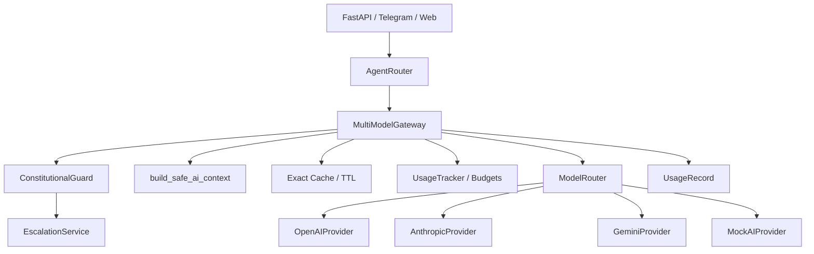

# Stage 9: MultiModel AI Gateway

Date: 2026-07-18

## Scope

This stage rebuilds the ATLAS AI boundary into an asynchronous, provider-neutral `MultiModelGateway`.

Primary goals:

- pass the user message to providers as user content, never as system instruction;
- keep ATLAS Constitution as the first system prompt block for every model;
- route tasks between OpenAI, Anthropic, Gemini and mock fallback;
- prevent personal cache mixing between users;
- minimize and mask profile data before model calls;
- create real escalation cases before claiming coordinator handoff;
- record usage and enforce configured budgets.

## Created Files

- `ai/models.py`
- `ai/cache.py`
- `ai/privacy.py`
- `ai/constitutional_guard.py`
- `ai/escalation.py`
- `ai/usage_tracker.py`
- `ai/router.py`
- `ai/structured_outputs.py`
- `ai/prompts/atlas_constitution.txt`
- `ai/prompts/candidate_agent.txt`
- `ai/prompts/employer_agent.txt`
- `ai/prompts/matching_agent.txt`
- `ai/prompts/risk_classifier.txt`
- `ai/prompts/document_analyzer.txt`
- `tests/test_multimodel_gateway.py`

## Changed Files

- `ai/ai_gateway.py`
- `ai/gemini_provider.py`
- `ai/mock_provider.py`
- `ai/providers.py`
- `ai/__init__.py`
- `services/gemini_service.py`
- `core/agent_router.py`
- `api/app.py`
- `.env.example`
- `tests/test_ewu_bot_webhook_security.py`

## Architecture



## Key Runtime Contract

Provider calls now use:

```python
async def call_model(
    self,
    *,
    system_prompt: str,
    user_message: str,
    context: dict[str, Any],
    role: str,
    estimated_tokens: int,
) -> ModelResult:
    ...
```

All providers return `ModelResult` with provider, model, tokens, cost estimate, latency and cache metadata.

## Environment

`.env.example` now includes:

```env
OPENAI_API_KEY=
ANTHROPIC_API_KEY=
GEMINI_API_KEY=
OPENAI_MODEL=gpt-4.1-mini
ANTHROPIC_MODEL=claude-3-5-haiku-latest
GEMINI_MODEL=gemini-2.5-flash
AI_DEFAULT_TIMEOUT_SECONDS=30
AI_MAX_RETRIES=2
AI_LONG_CONTEXT_THRESHOLD=12000
AI_MAX_OUTPUT_TOKENS=900
MATCHING_AI_TOP_N=10
AI_DAILY_BUDGET_EUR=
AI_MONTHLY_BUDGET_EUR=
AI_USER_DAILY_LIMIT=
AI_TENANT_MONTHLY_LIMIT=
```

## Installation

```powershell
py -3.12 -m pip install -r requirements.txt
```

## Test Command

```powershell
py -3.12 -m unittest discover -s tests -p "test*.py"
```

Result:

```text
Ran 84 tests in 6.453s
OK
```

`pytest` is not installed in the local Python environment, so verification used standard `unittest`.

## FastAPI Example

```python
from contextlib import asynccontextmanager
from fastapi import FastAPI
from ai.ai_gateway import get_default_ai_gateway

@asynccontextmanager
async def lifespan(app: FastAPI):
    gateway = get_default_ai_gateway()
    app.state.gateway = gateway
    yield
    await gateway.close()

app = FastAPI(lifespan=lifespan)
```

The current `/api/ai/message` endpoint now routes through `send_message_to_ai(...)`, so it uses the gateway instead of calling Gemini directly.

## Candidate Example

```python
result = await gateway.ask(
    user_id="candidate-1",
    role="candidate",
    context={"user_id": "candidate-1", "role": "candidate", "language": "uk", "profile": {"profession": "welder"}},
    message="Я зварювальник і хочу роботу в Польщі.",
)
```

## Employer Example

```python
result = await gateway.ask(
    user_id="employer-1",
    role="employer",
    context={"user_id": "employer-1", "role": "employer", "language": "uk"},
    message="Потрібно 5 зварювальників MIG/MAG у Польщу.",
)
```

## Escalation Example

For:

```text
Роботодавець забрав мої документи і не дозволяє піти.
```

`ConstitutionalGuard` marks the case as urgent or emergency and `JsonEscalationService` writes a real case to `ATLAS_DATA_DIR/ai_escalations.jsonl`.

Only after successful creation may ATLAS respond:

```text
Справу №ATLAS-... передано координатору ATLAS.
```

If escalation storage fails, the response status is `escalation_failed`.

## Fallback Example

General chat route:

```text
openai -> anthropic -> gemini -> mock
```

Large document route:

```text
gemini -> anthropic -> openai -> mock
```

Final matching route:

```text
anthropic -> openai -> mock
```

The total attempts are limited by `AI_MAX_RETRIES`.

## Usage Record Example

```python
UsageRecord(
    tenant_id="default",
    user_id="candidate-1",
    request_id="...",
    provider="openai",
    model="gpt-4.1-mini",
    task_type="chat",
    input_tokens=120,
    output_tokens=80,
    cached_tokens=0,
    estimated_cost=None,
    latency_ms=700,
    success=True,
    fallback_used=False,
)
```

## Temporary Limits

- Redis is represented by `RedisTTLCache`, but no Redis dependency is installed by default.
- OpenAI and Anthropic adapters use HTTPS through `requests` inside `asyncio.to_thread` to avoid blocking the event loop without adding new dependencies.
- Semantic cache is interface-only and intentionally disabled for production-sensitive categories.
- Final matching pipeline exposes deterministic Top-N helper; deeper integration into existing matching workflows remains a later stage.
- Existing synchronous agents are preserved through a compatibility wrapper. New code should prefer `await gateway.ask(...)`.
